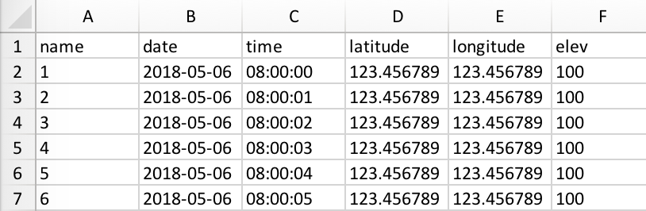
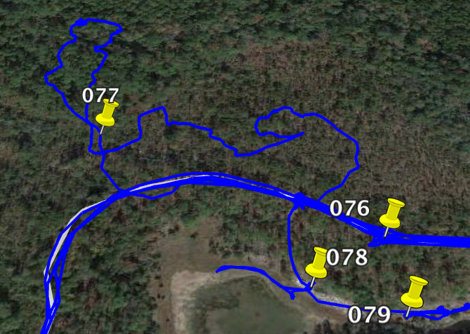

# GPS-Utils
Command line utilites for accessing and visualizing data from a Garmin GPS device.

- GPS2CSV
    - Load GPS data into excel or similar program or just output to file
- GPS2KML
    - Load GPS data into Google Earth or just output to KML file

This package has only been tested on a Mac but should work on Linux and may work on Windows operating systems.


## Installation
To install enter the following command into your terminal:

```bash
pip install git+https://github.com/kerrycobb/gps-utils
```


## GPS2CSV
Load data from GPS into csv file and open in system default application



#### Usage
For the most basic usage simply enter `gps2csv` at the command line. This will load all waypoints from a GPS unit named GARMIN and output it to a CSV file in the current working directory and then open the CSV file in your systems default application.

For a list of all options enter `gps2csv -h` and you will see the following output:

```
gps2csv [OPTIONS]

Options:
  --device TEXT        Name of device to get waypoints from. Default: GARMIN
  --format TEXT        File format to output waypoints to. Default: csv
  --sort_by TEXT       Column to be sorted in output csv; use "name", "date", "time", "latitude", or "elev". Default: name
  --auto_open BOOLEAN  Open file automatically. Default: True
  --output FILENAME    Path to output file. Default: <current workdir path>/<device name>.csv
  -h, --help           Show this message and exit.
```


## GPS2KML
Load waypoints and/or tracks into KML file and open in Google Earth.



#### Usage
For the most basic usage simply enter `gps2kml` at the command line. This will load all waypoints and tracks from a GPS unit named GARMIN and output it to a KML file in the current working directory and then open the KML file in Google Earth.

For a list of all options enter `gps2kml -h` and you will see the following output:

```
Usage: gps2kml [OPTIONS]

  Load data from GPS into Google Earth

Options:
  --device TEXT        Name of device to get waypoints from. Default: GARMIN
  --output FILENAME    Path to output file. Default: "<current workdir path>/<device name>.kml"
  --auto_open BOOLEAN  Open file automatically. Default: True
  --data TEXT          Data to load from gps. Valid options are: "all", "tracks", "waypoints"
  --archive TEXT       Load
  -h, --help           Show this message and exit.
```


#### Tip
Google Earth will automatically tilt the window when zooming to your points and tracks which some may find annoying. This can be disabled in Google Earth `Preferences` under the `Navigation` tab. Check `Do not automatically tilt while zooming`
