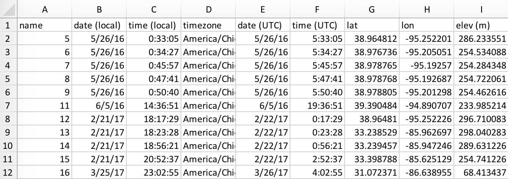
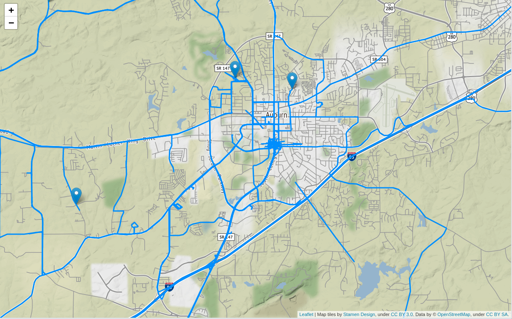

# GPS-Utils
Command line utilites for accessing and visualizing data from a Garmin GPS device.

- **GPS2CSV**
    - Output GPS waypoints to CSV file.
- **GPS2MAP**
    - Output GPS data to Leaflet map.
- **GPS2KML**
    - Output GPS data to Google Earth KML file.

<br><br>

## Installation
To install enter the following command into your terminal:

```bash
pip install git+https://github.com/kerrycobb/gps-utils
```

<br><br>

## GPS2CSV
Load waypoints from GPS into csv file.



#### Usage
For the most basic usage simply enter `gps2csv` at the command line. This will load all waypoints from a mounted GPS device named GARMIN and output it to a CSV file in the current working directory and then open the CSV file in your system's default application.

For a list of all options enter `gps2csv -h` and you will see the following output:

```
gps2csv [OPTIONS]

  Load waypoints from GPS into csv file

Options:
  --device TEXT  Name of device to get waypoints from. Default: GARMIN
  --output FILENAME  Path to output file. Default: 
                       "<current workdir path>/<device name>.html"
  -h, --help     Show this message and exit.

```

<br><br>
## GPS2MAP
Output waypoints and/or tracks to Leaflet map in html file.



#### Usage
For the most basic usage simply enter `gps2map` at the command line. This will load all waypoints and tracks from a mounted GPS unit named GARMIN and output it to an html file in the current working directory.

For a list of all options enter `gps2map -h` and you will see the following output:

```
gps2kml [OPTIONS]

  Load data from GPS into Leaflet map 

Options:
  --device TEXT      Name of device to get data from. Default: GARMIN
  --output FILENAME  Path to output file. Default: 
                       "<current workdir path>/<device name>.html"
  -h, --help         Show this message and exit.

```

<br><br>

## GPS2KML
Output waypoints and/or tracks to Google Earth KML file.


#### Usage
For the most basic usage simply enter `gps2kml` at the command line. This will load all waypoints and tracks from a mounted GPS unit named GARMIN and output it to a KML file in the current working directory.

For a list of all options enter `gps2kml -h` and you will see the following output:

```
gps2kml [OPTIONS]

  Load data from GPS into Google Earth

Options:
  --device TEXT      Name of device to get data from. Default: GARMIN
  --output FILENAME  Path to output file. Default: 
                       "<current workdir path>/<device name>.kml"
  -h, --help         Show this message and exit.

```
